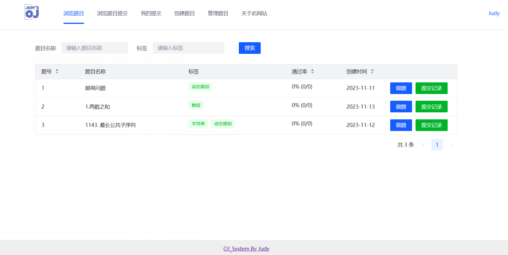
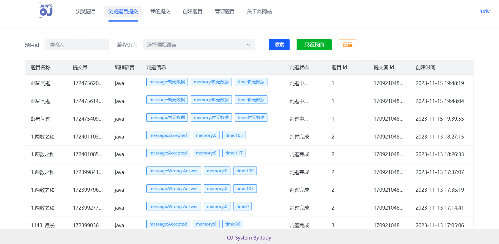
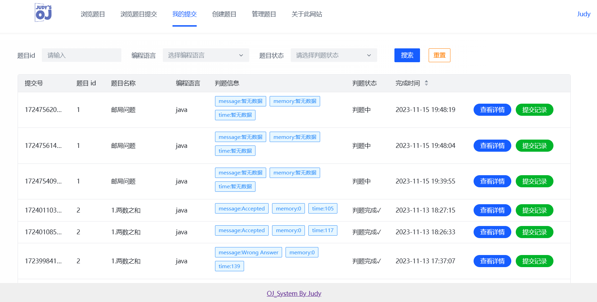
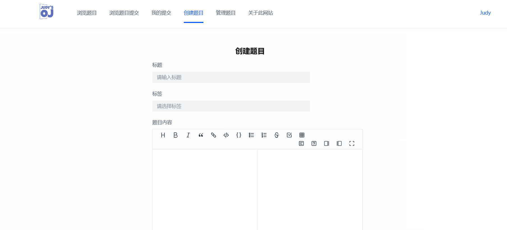
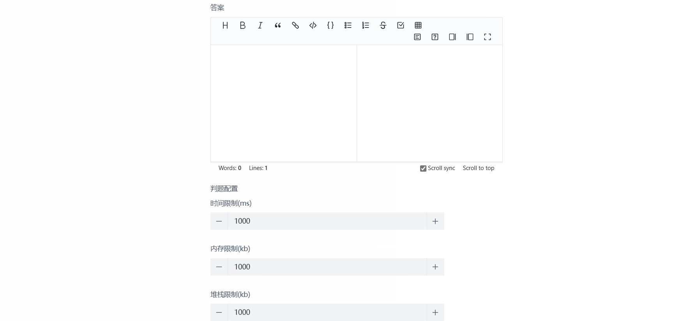
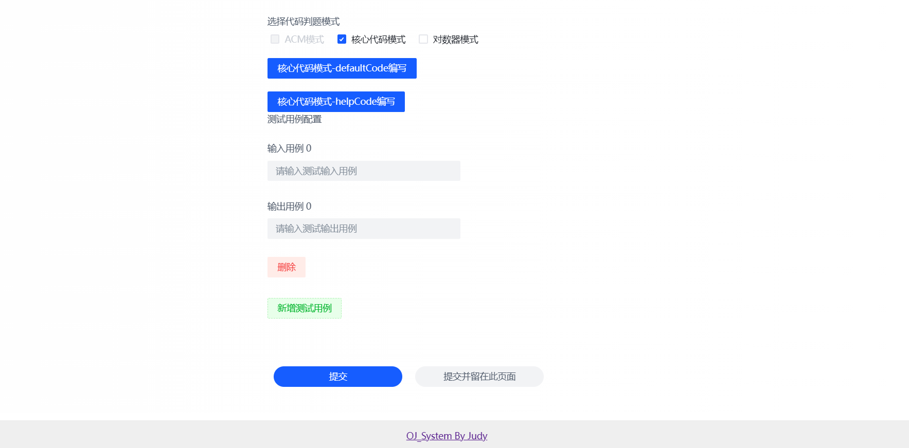
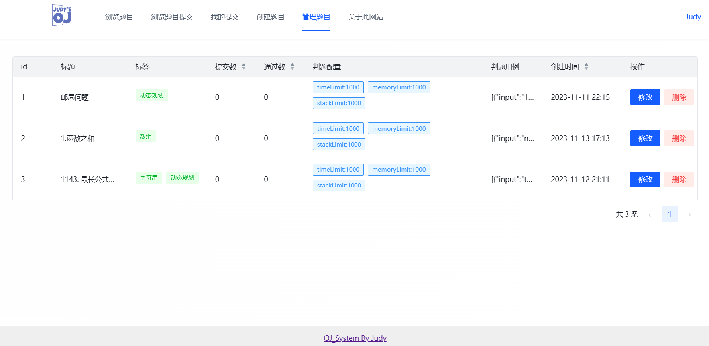
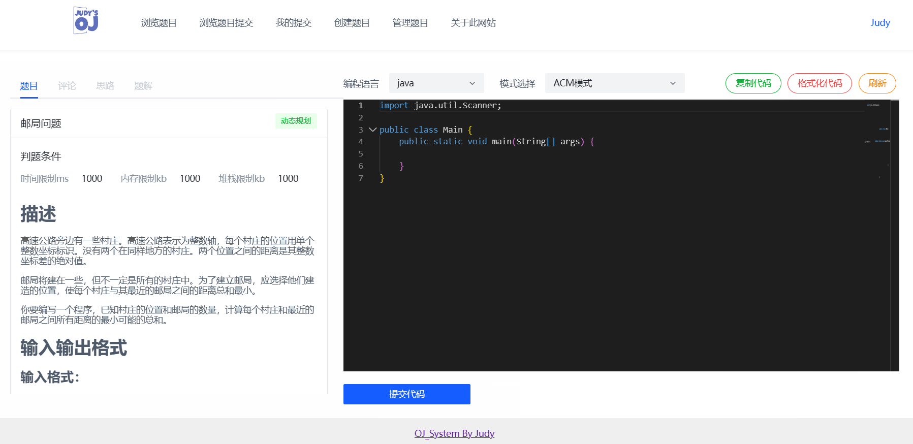

# JudyOJ (Online Judge)

> 项目作者：[Judy](http://)

## 项目介绍

本项目是一个基于Spring Boot、Spring Cloud Alibaba微服务、Docker、RabbitMQ和Vue 3的在线编程算法题目评测系统（简称OJ）。

系统具有高效、稳定的在线评测功能，用户可以轻松选择题目、编写代码并提交进行评测。系统能够根据用户提交的代码、出题人预先设置的题目输入和输出用例，进行编译代码、运行代码、判断代码运行结果是否正确。这一系列功能使得OJ成为一个强大且易于使用的在线判题评测系统。

通过本项目，用户可以在线进行编程练习，提高编程技能。同时，系统的模块化设计和微服务架构使得它具有良好的可扩展性和可维护性，方便进行二次开发和升级。
## 项目功能 

在系统前台，管理员可以创建、编辑管理题目；用户可以自由搜索题目、阅读题目、选择判题模式编写提交代码、查看编辑历史提交记录、。

在系统后端，能够根据管理员设定的题目测试用例在 **自主实现的代码沙箱** 中对代码进行编译、运行、判断输出是否正确。
其中，代码沙箱可以作为独立服务，提供给其他开发者使用。

### 代码沙箱服务
- 负责接受代码运行代码的业务，返回编译运行的结果
- [沙箱项目地址](https://github.com/JudyOne1/CodeSandbox)

## 项目核心亮点

1. 权限校验
   - 用户权限校验（使用spring切面实现）
2. 判题机模块
   - 自主设计判题机模块的架构，定义了代码沙箱的抽象调用接口和多种实现类。
   - 通过 静态工厂模式 + Spring 配置化 的方式实现了对多种代码沙箱的灵活调用。
3. 代码沙箱安全性
   - 使用 守护线程 + Thread.sleep 等待机制实现了对进程的超时中断。
   - 使用 JVM -Xmx 参数限制用户程序占用的最大堆内存。
   - 使用 黑白名单 + 字典树 的方式实现了对敏感操作的限制。
   - 使用 Java 安全管理器和自定义的 Security Manager 对用户提交的代码进行权限控制。
   - 选用 Docker 隔离用户代码，使用 Docker Java 库创建容器隔离执行代码，并通过 tty 和 Docker 进行传参交互。
   - 通过 HostConfig 限制了容器的内存限制和网络隔离，并通过设置容器执行超时时间解决资源未及时释放的问题。
   - 采用 API 签名认证的方式保证调用API的安全性
4. 多种判题模式的支持
   - 支持ACM模式
   - 支持leetcode核心代码模式
   - 支持对数器模式


## 项目技术栈和特点

### 后端

1. Spring Boot：简化Spring开发框架
2. Spring MVC：
3. Spring Boot 调试工具和项目处理器
4. Spring AOP 切面编程
5. Spring 事务注解
6. Spring Cloud Alibaba
7. Spring Gateway
8. MyBatis + MyBatis Plus 数据访问（开启分页）
9. MyBatis-Plus 数据库访问结构
10. Redis：分布式存储用户信息
11. Redisson：限流控制
12. JWT Token：用户鉴权
13. RabbitMQ：消息队列
14. Docker 代码沙箱，实现隔离环境运行Java程序
15. Java安全管理器：保护 JVM、Java 安全的机制，实现对资源的操作限制
16. Nacos：服务注册管理中心
17. OpenFeign：微服务模块之间调用

### 前端

1. Vue 3
2. Vue Router: 路由管理
3. Vue-Cli 脚手架
4. Axios: HTTP客户端
5. Bytemd: Markdown 编辑器
6. Monaco Editor: 代码编辑器
7. highlight.js: 语法高亮
8. Moment.js: 日期处理库
9. Arco Design Vue: UI组件库
10. TypeScript: 静态类型系统

### 数据存储

- MySQL 数据库
- 阿里云 OSS 对象存储

### 通用特性

- Spring Session Redis 分布式登录
- 全局请求响应拦截器（记录日志）
- 全局异常处理器
- 自定义错误码
- 封装通用响应类
- Swagger + Knife4j 接口文档
- 自定义权限注解 + 全局校验
- 全局跨域处理
- 长整数丢失精度解决
- 多环境配置
- IDEA插件 MyBatisX ： 根据数据库表自动生成
- Hutool工具库 、Apache Common Utils、Gson 解析库、Lombok 注解

### 单元测试

- JUnit5 单元测试、业务功能单元测试

### 设计模式

- 静态工厂模式
- 代理模式
- 策略模式

### 远程开发

- VMware Workstation虚拟机
- Ubuntu Linux 18
- Docker环境
- 使用JetBrains Client连接

### 单体项目目录结构

```
├─sql  // 项目的SQL文件：创建数据库和数据表
├─src
   ├─main
      ├─java
      │  └─com
      │      └─shieroj
      │          ├─annotation // 权限控制
      │          ├─aop    //AOP切面
      │          ├─common // 通用类
      │          ├─config // 项目配置
      │          ├─constant // 项目常量
      │          ├─controller // 前端请求
      │          ├─exception  // 项目异常
      │          ├─judge      // 判题服务
      │          │  ├─codesandbox  // 代码沙箱
      │          │  │  ├─impl
      │          │  │  └─model
      │          │  └─strategy
      │          ├─manager  // 管理
      │          ├─mapper   // 数据访问（操作数据库）
      │          ├─model    // 项目实体
      │          │  ├─dto
      │          │  │  ├─file
      │          │  │  ├─question
      │          │  │  ├─questionsumbit
      │          │  │  └─user
      │          │  ├─entity
      │          │  ├─enums
      │          │  └─vo
      │          ├─mq      // 消息队列
      │          ├─service // 项目服务
      │          │  └─impl
      │          └─utils   // 项目工具
      └─resources // 项目资源配置
          └─mapper
```

## OJ项目展示

### 登录注册页面


### 网站主页(管理员)

### 提交查看页面(管理员/用户)

### 个人提交查看页面(管理员/用户)


### 题目新增/修改页面(管理员)



### 题目管理页面(管理员)


### 做题页面(管理员/用户)


## 项目后续扩展

- 实现多种语言的代码沙箱（目前仅支持Java）
- 拓展使用AI判题

